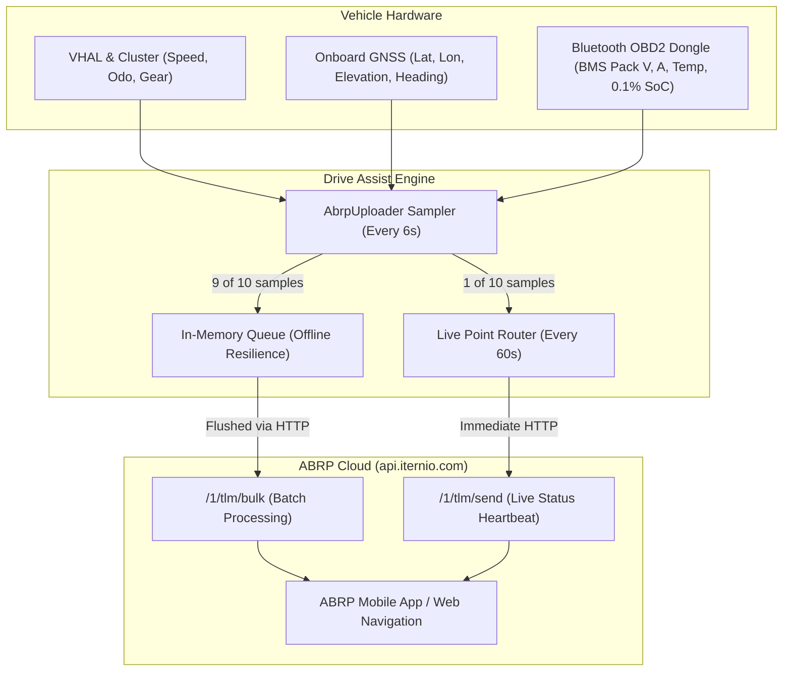

# ABRP Live Telemetry & OBD2 Guide

> **Live SoC, consumption modeling, and Bluetooth OBD2 BMS telemetry setup for A Better Routeplanner on Geely EX2 / Geometry E (IHU629G).**

**A Better Routeplanner (ABRP)** is the gold standard for EV route planning and charging stop optimization. Drive Assist features a native background telemetry engine (`AbrpUploader`) that streams live vehicle data directly to the ABRP servers (`api.iternio.com`), providing 100% accurate range forecasts based on your actual consumption, terrain, and weather.

---

## 🚀 How ABRP Integration Works

Standard route planners guess consumption based on static vehicle profiles. With Drive Assist:
* **Live State of Charge (SoC)**: ABRP knows your exact battery level at every moment.
* **Instant Power & Speed**: Real-time energy flow (kW) and speed (km/h) calibrate your vehicle's aerodynamic drag and rolling resistance curves.
* **Elevation & Heading**: Real-time GPS elevation allows ABRP to predict energy requirements over mountain climbs and regenerative braking on descents.
* **Battery Temperature**: Pack temperature (°C) enables ABRP to predict DC fast charging taper curves.



---

## 📡 Data Fields Forwarded to ABRP

The telemetry payload conforms to the official **ITERNIO Telemetry Specification (v1)**:

| ABRP Field | Description | Source in Drive Assist | Fallback |
| :--- | :--- | :--- | :--- |
| `utc` | Unix timestamp in seconds | System clock | Required |
| `soc` | Battery State of Charge (%) | **OBD2 BMS** (0.1% precision) | VHAL integer % |
| `power` | Instantaneous battery power (kW) | **OBD2 BMS** (Pack Volts × Amps / 1000) | VHAL power estimate |
| `speed` | Current vehicle speed (km/h) | Wheel speed sensors via VHAL | — |
| `lat`, `lon` | Geographic coordinates | IHU GNSS receiver | None (optional) |
| `elevation` | Altitude above sea level (meters) | IHU GNSS receiver | None |
| `heading` | Compass heading (degrees, 0–360) | IHU GNSS receiver | None |
| `is_charging`| Active charging flag (1 or 0) | VHAL charge detection | — |
| `is_dcfc` | DC Fast Charging flag (1 or 0) | High-voltage pack sensor (>250V DC) | 0 (AC charging) |
| `is_parked` | Parked indicator (1 or 0) | Transmission gear == `P` | 0 |
| `odometer` | Total accumulated mileage (km) | Instrument cluster ECU | — |
| `est_battery_range`| Dashboard estimated range (km)| Instrument cluster range prediction | — |
| `ext_temp` | Ambient outside temperature (°C) | Front bumper HVAC sensor | — |
| `voltage` | High-voltage pack voltage (V) | OBD2 Battery ECU | — |
| `current` | High-voltage pack current (A) | OBD2 Battery ECU (+ discharge, - charge) | — |
| `batt_temp` | Battery cell core temperature (°C)| OBD2 BMS internal sensor | — |

---

## 🛠️ Step-by-Step Setup

### Step 1: Obtain Your ABRP User Token
1. Open the **A Better Routeplanner** app (iOS/Android) or visit [abetterrouteplanner.com](https://abetterrouteplanner.com).
2. Log in to your ABRP account.
3. Add your car model: Select **Geometry E / Geely EX2** (or equivalent 39.4 kWh LFP model).
4. Navigate to: **Settings** → **My Vehicles** → select your vehicle → **Live Data**.
5. Select **Generic (OBD/Enode/Torque)** as the connection type.
6. Copy your unique **User Token** (a UUID such as `12345678-abcd-ef01-2345-6789abcdef01`).

### Step 2: Configure Drive Assist
1. On the car's screen, open **Settings** and select the **OBD & ABRP** tab.
2. Toggle ON **Habilitar telemetria ABRP**.
3. In the **ABRP User Token** field, paste or type your User Token.
4. **Enviar Localização (GPS)**: Keep enabled so ABRP can calculate real-time routing along your active path.
5. Tap **[ Salvar & Testar Conexão ]**:
   * Drive Assist immediately transmits a test telemetry packet to `api.iternio.com/1/tlm/send`.
   * Check the feedback text below the button: **`sent (OK)`** confirms successful linking.
6. Check your ABRP app: The car icon will show a green dot with **"Live Data: Connected"**.

---

## 🔌 Enhancing Accuracy: Bluetooth OBD2 Dongle Setup

While Drive Assist works completely standalone using the car's built-in VHAL, pairing an **OBD2 Bluetooth dongle** unlocks decimal-level precision (0.1% SoC) and live battery power (kW) polled directly from the Battery Management System (ECU `0x7E2`).

### Supported Adapters
* **Tested & Verified**:
  * **vLinker MC+** (Classic identity: `vLinker MC-Android`) — the only adapter
    actually tested against this head unit. Everything below is untested,
    listed only because it uses the same Classic Bluetooth ELM327 protocol
    and should work the same way — not a confirmed claim.
* **Untested, believed compatible (Classic Bluetooth 2.1/3.0 / Dual-Mode)**:
  * OBDLink LX / MX
  * Standard ELM327 Bluetooth v1.5/v2.1
* **Untested, believed compatible (BLE — Bluetooth Low Energy)**:
  * OBDLink CX, Vgate iCar Pro BLE 4.0, Veepeak OBDCheck BLE+

---

### ⚠️ The IHU629G Bluetooth Pairing Wall (Important!)

> [!WARNING]
> **Tested pairing failure:**
> The tested vLinker MC+ fails from the car's Bluetooth settings screen because
> this IHU silently sends its configured `"0000"` PIN without a prompt. Other
> adapters are untested; do not change the system PIN unless your adapter fails
> normal pairing and is known to require `"1234"`.

### How to Pair Your OBD2 Dongle via ADB

An OBD2 adapter is optional. Drive Assist and ABRP work with native vehicle
readings without one. Only if the adapter needs the workaround, pairing requires
root ADB to override the system PIN or trigger programmatic bonding:

#### Method 1: Temporary Default-PIN Override
We provide automated helper scripts in the repository (`bt-pin-fix/`):
```bash
# From the repository, with the car parked:
./bt-pin-fix/apply-pin-1234.sh <CAR_IP>
```
3. Once the Bluetooth service restarts with the updated PIN, plug the dongle into the OBD2 port, open the car's Bluetooth screen (or trigger pairing), and it will bond immediately without errors.
4. **Right after pairing succeeds, revert the PIN:**
   ```bash
   ./bt-pin-fix/revert-pin-0000.sh
   ```

> [!WARNING]
> **This is an optional, persistent, system-wide change.** It changes the
> automatic simple-pairing PIN for every Bluetooth device while active and
> survives uninstall and factory reset. Do it only while parked and when it will
> not interrupt a call or media session. The scripts replace the complete
> configuration file captured from the tested firmware; do not apply or revert
> them after an IHU update until the on-car file has been checked. Android keeps
> the dongle's bond key, so restore `0000` immediately after pairing succeeds.

#### Method 2: Headless Command-Line Pairing via ModeHelper
If you prefer not to modify system files, the trusted companion app
[`modehelper`](../modehelper/README.md) can execute a direct headless bond for a
specified MAC address. This remains an optional privileged operation:
```bash
# Obtain the dongle's MAC address (e.g. from an Android phone scan or HCI log)
adb shell am broadcast -a com.geely.modehelper.BT_PAIR \
    --es addr "AA:BB:CC:DD:EE:FF" \
    --es pin "1234" \
    -n com.geely.modehelper/.BtPairReceiver
```

---

### Activating OBD2 in Drive Assist
Once paired and listed under **Bonded devices** in Android:
1. Open the **OBD & ABRP** tab in Drive Assist.
2. Toggle ON **Habilitar Leitor OBD2**.
3. Drive Assist's background reader automatically connects to the bonded device, initializes the BMS ECU header (`ATSH7E2`), and begins polling real-time battery voltage, current, and fine SoC.
4. The live readings will appear on screen and seamlessly stream to ABRP and Home Assistant.

> [!TIP]
> **OBD2 is Completely Optional**:
> If you do not have an OBD2 dongle or do not wish to perform the ADB pairing setup, **Drive Assist operates 100% functionally using the car's native VHAL**. State of charge, speed, odometer, and power estimates continue to flow to ABRP without interruption.

---

## 📴 Offline Resilience (Tunnels & Dead Zones)

Cellular connectivity can drop during road trips, mountain passes, or tunnels. Drive Assist handles dead zones cleanly:
1. **In-Memory Queue**: When `api.iternio.com` is unreachable, samples are stored in an in-memory queue (up to 200 readings, representing over 20 minutes of continuous driving).
2. **Bulk Flush**: As soon as cellular tethering or Wi-Fi reconnects, Drive Assist sends the accumulated backlog in a single compressed batch via `/1/tlm/bulk`.
3. **No Hole in History**: ABRP receives the full drive history without gaps in elevation or consumption.

---

## 🔒 Privacy Controls

* **Independent Location Toggle**: If you wish to use ABRP for consumption tracking without sharing geographic coordinates, simply disable **Enviar Localização (GPS)** in the settings. Drive Assist will forward battery, speed, and power while omitting latitude, longitude, elevation, and heading.
* **Local Storage**: Your ABRP user token is stored strictly inside the app's sandboxed `SharedPreferences` on the head unit. It is never logged, exposed to other apps, or transmitted to any server other than ABRP's official endpoint (`https://api.iternio.com`).

---

## 🔍 Troubleshooting

| Issue | Cause | Solution |
| :--- | :--- | :--- |
| **Test returns "missing user token"** | Token field is empty | Copy your generic token from the ABRP app and paste it into the field. |
| **Test returns "send failed"** | No internet connection | Ensure the head unit is connected to Wi-Fi or a phone mobile hotspot. |
| **Car shows "offline" in ABRP app** | Vehicle is parked and idle | ABRP only considers vehicles online while actively driving (`speed > 1 km/h`) or actively charging (`is_charging == 1`). |
| **OBD2 status stays "Procurando..."** | Dongle is not powered or unbonded | Ensure car ignition is ON. If using Classic BT, check that the dongle is paired in Android Bluetooth settings. |
| **Power shows 0 kW** | OBD2 not connected | Without an OBD2 dongle, power is estimated from speed and acceleration. Connect an OBD2 dongle to read true battery pack current. |
