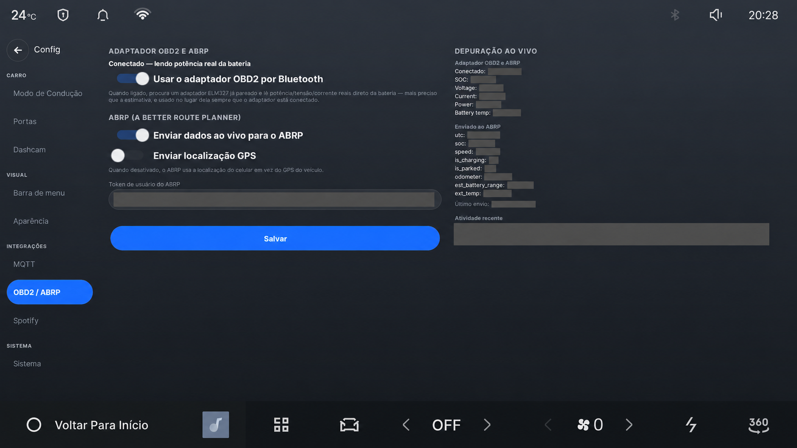

# Conecte o Drive Assist ao A Better Routeplanner

[English](ABRP.md) · **Português (Brasil)**

O Drive Assist pode enviar ao A Better Routeplanner (ABRP) dados atuais de
bateria, velocidade, potência, recarga e, se você permitir, localização. O ABRP
usa essas leituras para estimar consumo e paradas de recarga.

As áreas cinzas ocultam o token do ABRP e as leituras do veículo do proprietário.

## Antes de começar

Adicione o carro à sua conta do ABRP e selecione a conexão genérica de dados ao
vivo. O ABRP fornecerá um token de usuário para esse veículo. Trate o token como
uma senha: quem o obtiver poderá enviar dados para o seu veículo no ABRP.

O adaptador OBD2 é opcional. Sem ele, o Drive Assist usa as leituras que já estão
disponíveis no carro. Um adaptador compatível pode acrescentar porcentagem mais
precisa, tensão, corrente e temperatura da bateria.

## Conecte o carro

1. No ABRP, abra as configurações de **Dados ao vivo** do veículo, escolha a
   conexão genérica e copie o token de usuário.
2. Na central, abra **Configurações → OBD2 / ABRP**.
3. Ative a telemetria do ABRP e informe o token.
4. Escolha se deseja enviar a localização GPS. Ao desativá-la, coordenadas,
   altitude e direção não são enviadas; os dados de bateria e energia ainda podem
   ser transmitidos.
5. Salve as configurações e execute o teste de conexão.
6. Abra o ABRP e confirme que o veículo apresenta dados ao vivo.

O carro envia essas informações pela internet ao serviço do ABRP. Os termos de
conta, privacidade e retenção do ABRP valem para os dados recebidos pelo serviço.

Para adicionar um adaptador OBD2, leia o aviso de segurança antes de ativar o ADB
root ou alterar a configuração Bluetooth da central. As instruções de pareamento,
os adaptadores compatíveis, os campos transmitidos e os detalhes de diagnóstico
estão na [referência técnica de ABRP e OBD2](ABRP-GUIDE.md).
