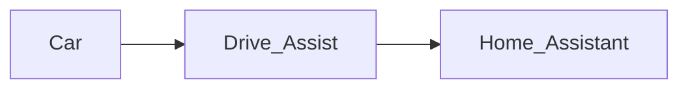

# Writing documentation

The documentation site is built with Jekyll from this `docs/` directory. Existing
guides remain ordinary Markdown files; Jekyll supplies the shared navigation and
page frame when it publishes them.

## Add or update a guide

Write a normal Markdown file in `docs/`. Add it to the `_data/navigation.yml`
source file when it belongs in the permanent library. Prefer a guide when the
reader needs instructions or a stable reference.

## Add a diagram

Use a fenced code block marked `mermaid`. The site converts it into a responsive
SVG diagram when the page loads:

````markdown

````

Keep labels concise and do not put untrusted HTML in diagrams. Mermaid is loaded
with its strict security setting.

## Preview locally

With Ruby and Bundler available:

```bash
bundle install
bundle exec jekyll serve --source docs --baseurl /drive_assist
```

The GitHub Pages workflow builds the same source on pushes to `master`. It does
not build or deploy the Android application.
