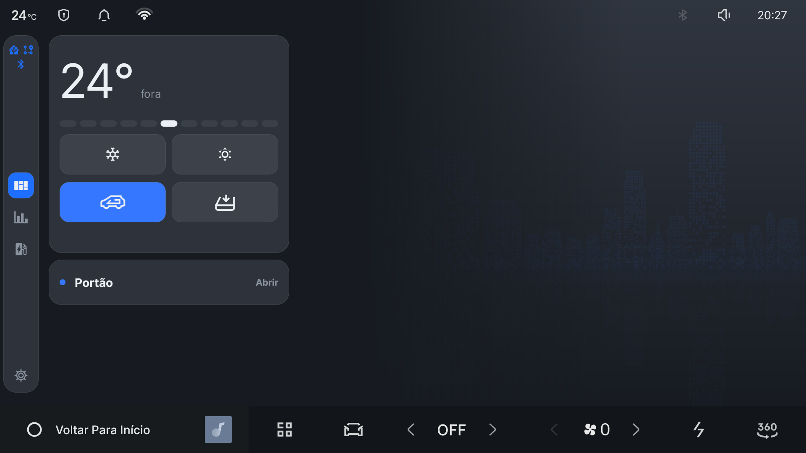
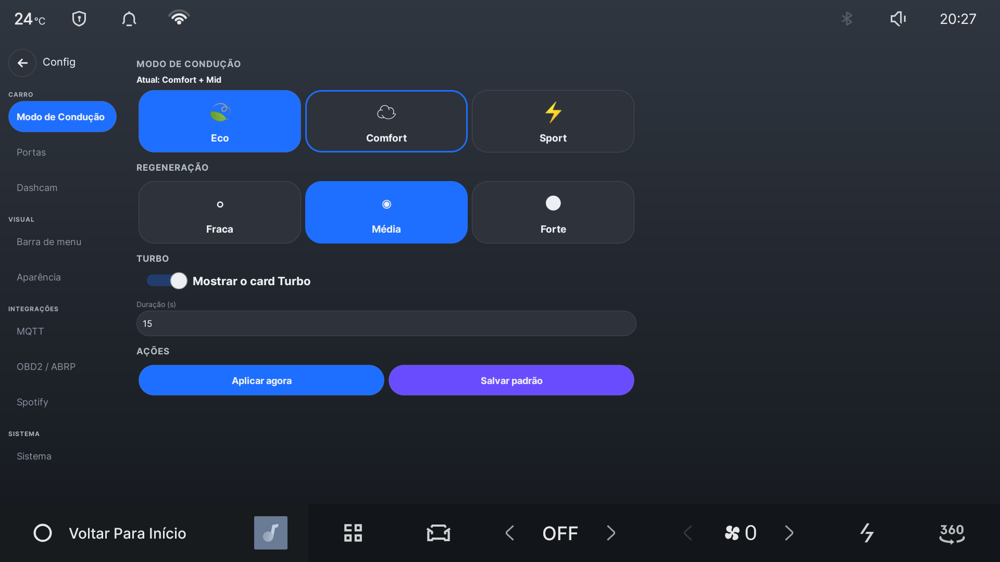
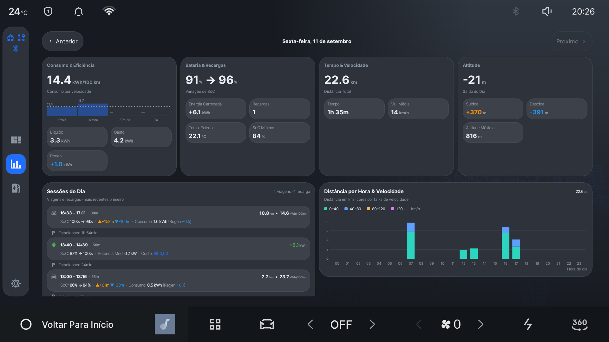
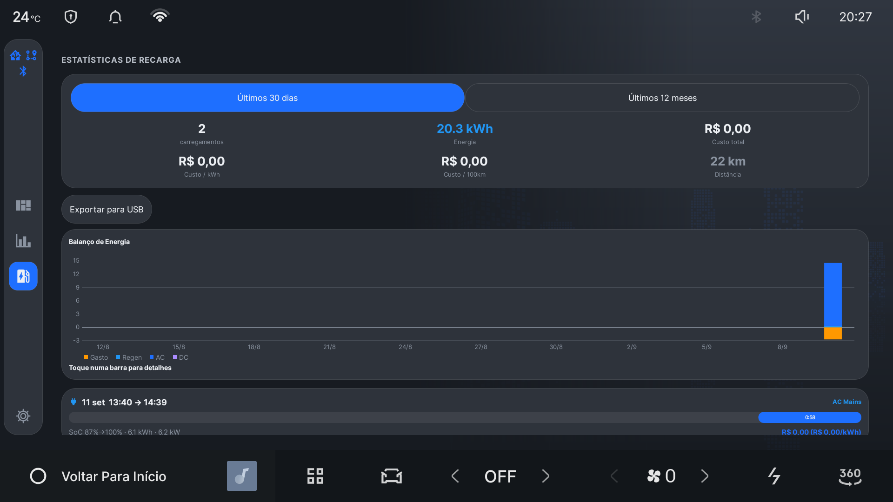

# Drive Assist: guia para motoristas

[English](DRIVER-GUIDE.md) · **Português (Brasil)**

O Drive Assist acrescenta à central do Geely EX2 / Geometry E recursos que fazem
falta no dia a dia: atalhos de climatização, histórico de viagens e recargas,
custos de energia, informações úteis do carro e conexões opcionais com serviços
que você já usa.

Este guia apresenta o produto e sua operação. Protocolos, identificadores do
veículo e evidências da pesquisa permanecem disponíveis na
[biblioteca técnica](README.md#technical-library).

## Seu painel para o dia a dia

A primeira tela foi feita para ser usada rapidamente no carro:

- a temperatura externa aparece em destaque;
- a régua de conforto pede mais frio ou mais calor sem exigir vários ajustes;
- botões grandes dão acesso ao ar-condicionado, aquecimento, recirculação e
  desembaçamento;
- durante a recarga, um cartão mostra o progresso e a previsão de término;
- cartões opcionais podem mostrar o portão de casa e informações enviadas pelo
  Home Assistant.

Os comandos têm áreas de toque grandes e a tela evita ficar cheia de controles.
Assim, as informações continuam legíveis com uma olhada rápida.

## O carro lembra suas preferências

Escolha o modo de condução e o nível de regeneração preferidos. O Drive Assist
pode restaurá-los ao ligar o carro, sem repetir os mesmos ajustes em toda viagem.
Você também escolhe quais cartões, ícones e imagens aparecem no painel.

## Entenda cada dia, não apenas o hodômetro

As Estatísticas Diárias transformam os dados do carro em um diário útil:

- distância, tempo em movimento, velocidade média e variação da bateria;
- energia consumida e recuperada pela regeneração;
- eficiência por faixa de velocidade;
- subidas, descidas e balanço de altitude;
- linha do tempo com viagens e recargas, deixando visível o tempo estacionado;
- distância percorrida em cada hora, com cores por faixa de velocidade.

O uso do ar-condicionado estacionado não altera a eficiência de condução. Quando
o carro está engatado, as paradas no trânsito fazem parte da viagem e entram no
cálculo corretamente.

## Acompanhe recargas e custos

A tela Estatísticas de Recarga guarda as sessões anteriores com energia, duração,
variação da bateria e potência média. Com o carro estacionado, toque em uma
sessão para incluir ou corrigir o preço pago. Uma recarga gratuita pode ter preço
zero, sem ser confundida com uma sessão cujo preço ainda não foi informado.

O gráfico de 30 dias compara a energia que saiu da bateria com a energia que
voltou por regeneração, recarga AC e recarga rápida DC. Uma recarga que atravessa
a meia-noite é dividida entre os dias em que aconteceu.

## Conecte seus próprios serviços

As integrações são opcionais. O painel funciona sem elas.

### Home Assistant

Conecte o Drive Assist ao seu servidor Home Assistant para acompanhar bateria,
autonomia, localização, recarga, climatização e outros dados. O Home Assistant
também pode enviar um cartão para a tela do carro e exibir o botão do portão
quando o veículo chega em casa.

Os dados vão para o servidor configurado por você. O projeto não opera um serviço
de análise que receba esses dados. Veja o [guia do Home Assistant](HOME-ASSISTANT.pt-BR.md).

### A Better Routeplanner

O Drive Assist pode enviar bateria e posição em tempo real ao ABRP para melhorar
o planejamento de viagens. Um adaptador Bluetooth OBD2 opcional fornece dados
mais precisos da bateria. Veja o [guia do ABRP](ABRP.pt-BR.md).

### Dashcam

A dashcam opcional usa as câmeras existentes no carro e pode adicionar horário,
posição e velocidade às gravações. Os vídeos podem ser copiados para um pen drive.
Leia o [guia da dashcam](DASHCAM.md) antes de ativá-la.

## Limites de controle

O Drive Assist atua em funções de conforto e conveniência, como climatização,
modo de condução, regeneração, iluminação interna, preferências de recarga e o
comando opcional do portão pelo Home Assistant.

O aplicativo não dirige, freia, acelera, destranca portas nem abre o porta-malas.
Os sinais de portas e carroceria exibidos são apenas de leitura. O
[guia de segurança e privacidade](WELCOME.md) explica esses limites.

## Instalação

Para a maioria dos proprietários, o caminho mais fácil é o instalador em um único
arquivo. Siga o [guia rápido de instalação](QUICK-INSTALL.pt-BR.md). A central do
carro já precisa estar preparada para instalar aplicativos de terceiros.

## Próximos passos

- [Instale o Drive Assist](QUICK-INSTALL.pt-BR.md)
- [Entenda o acesso ADB root](ADB-ROOT-SAFETY.pt-BR.md)
- [Conecte o Home Assistant](HOME-ASSISTANT.pt-BR.md)
- [Conecte o ABRP](ABRP.pt-BR.md)
- [Leia sobre segurança e privacidade](WELCOME.md)
- [Consulte as descobertas técnicas](README.md#technical-library)
