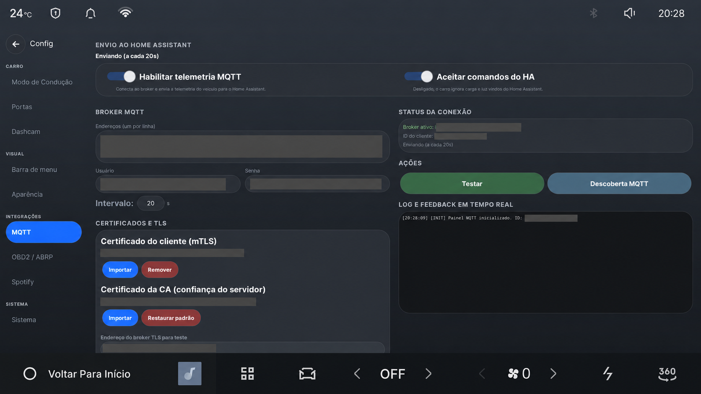

# Conecte o Drive Assist ao Home Assistant

[English](HOME-ASSISTANT.md) · **Português (Brasil)**

Essa conexão coloca no Home Assistant a bateria, a autonomia, a localização, o
estado da recarga, a climatização e outras leituras disponíveis no carro. Ela
também pode enviar comandos e informações selecionadas entre o Home Assistant e
o veículo.

As áreas cinzas ocultam endereços do broker, nome da conta, identificadores dos
certificados e identificadores do dispositivo. Esses valores não devem aparecer
em imagens publicadas.

## Antes de começar

Você precisa de:

- uma instalação funcional do Home Assistant;
- um broker MQTT usado pelo Home Assistant;
- endereço, porta, usuário e senha do broker;
- uma conexão de rede entre o carro e esse broker.

O carro publica dados detalhados de localização e uso. Use uma conexão
criptografada quando o tráfego sair da rede de casa. Crie uma conta MQTT separada
para o carro e permita acesso somente aos tópicos necessários do Drive Assist.

## Conecte o carro

1. Na central, abra **Configurações → MQTT**.
2. Ative **Telemetria MQTT**.
3. Informe o endereço do broker. Use `ssl://` ou `tls://` com a porta `8883` para
   uma conexão criptografada. Use `tcp://` com a porta `1883` somente em uma rede
   confiável.
4. Informe o usuário e a senha do MQTT.
5. Salve as configurações e selecione **Testar conexão**.
6. Selecione **Descoberta MQTT**. O Home Assistant deve criar um dispositivo para
   o carro e adicionar as entidades disponíveis.

A área de estado mostra o broker ativo e o envio mais recente. Um teste bem
sucedido confirma que o broker aceitou a conexão e as credenciais. A descoberta
no Home Assistant confirma que as entidades foram publicadas.

## Escolha o que o Home Assistant pode fazer

Telemetria e comandos remotos possuem controles separados. Deixe **Aceitar
comandos do Home Assistant** desativado se quiser apenas consultar os dados. Ao
ativá-lo, o Home Assistant pode enviar comandos compatíveis, como ajustes da
climatização, configurações de recarga e ações do modo de estacionamento.

O botão do portão e o painel de contexto também usam MQTT. O Home Assistant
decide quando mostrar o botão, recebe o toque, executa a ação do portão e devolve
o estado atual. O Drive Assist não procura nem controla um portão diretamente.

## Privacidade e segurança

O broker configurado recebe a telemetria ativada. Esses dados podem revelar a
posição do carro, trajetos, rotina de recarga e horários em que ele fica longe de
casa. Proteja a conta do broker, os certificados e qualquer imagem dessa tela.
Não publique endereços, usuários, senhas, tokens, partes do chassi ou coordenadas.

Para certificados, nomes de tópicos, lista de entidades, automações de exemplo e
mensagens de diagnóstico, consulte a [referência técnica de MQTT e Home Assistant](MQTT-GUIDE.md).
