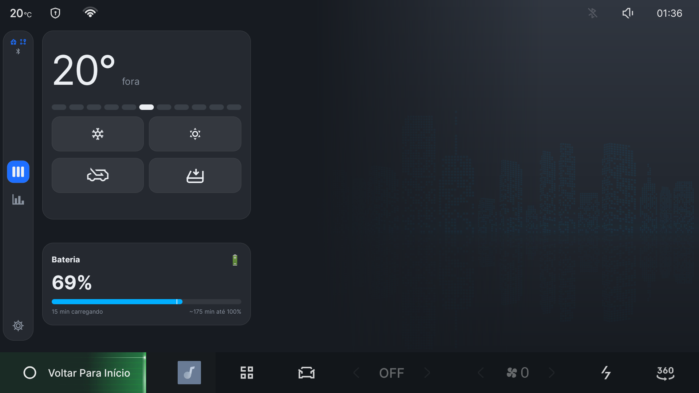
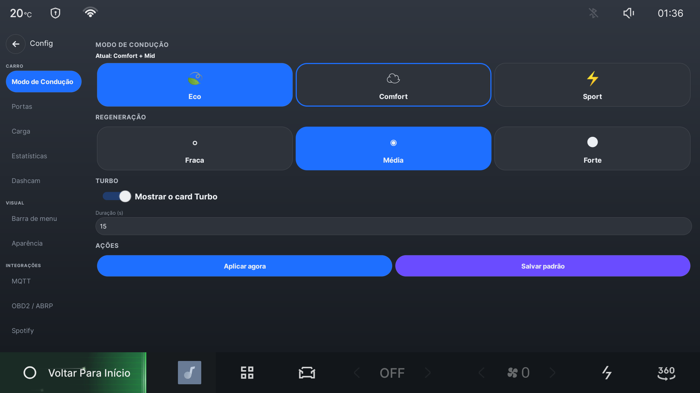
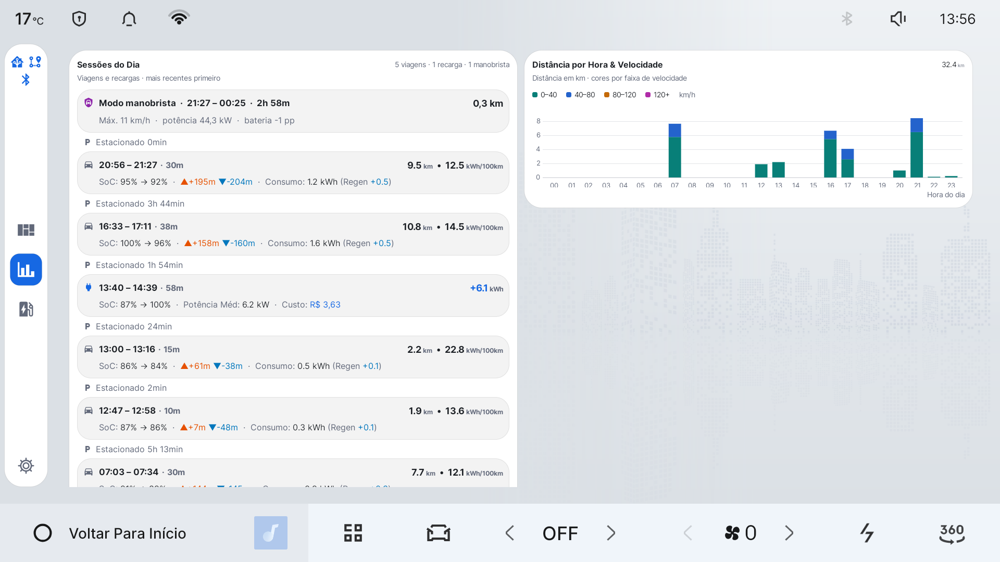

# Install Drive Assist

This guide is for a Geely EX2 / Geometry E whose centre screen has already been
unlocked to install third-party apps. If your car still has its original locked
software, follow a trusted IHU629G unlocking guide first.

## Choose the easiest method for you

| What you have | Use this method |
| --- | --- |
| A USB drive and a file manager on the car | [One-file USB installer](#method-1-the-1-file-usb-drive-method-no-computer-needed--recommended) |
| A computer already connected to the car through ADB | [Automatic Wi-Fi script](#method-2-the-one-shot-wi-fi-script-installsh--fastest-via-terminal) |
| ADB AppControl on Windows | [Windows graphical method](#method-4-using-adb-appcontrol-windows-gui-alternative) |
| You develop or troubleshoot Android software | [Manual ADB commands](#method-3-direct-manual-adb-commands-step-by-step-reference) |

Most owners should use the first method. It uses one APK, installs both parts of
Drive Assist, opens the dashboard, and removes the temporary installer afterward.
The other sections are reference material; you do not need to read them first.

Before beginning, park the car, keep the head unit powered, and download APKs only
from the project's official release page.

---

## Technical background: why the installer adds two apps

Drive Assist employs a dual-package architecture to comply with Android 9 automotive security constraints:

| Package | APK File | Role & Privileges | Key Capabilities |
| :--- | :--- | :--- | :--- |
| **All-in-One Installer** | `drive_assist_installer.apk` | **Disposable Setup Wizard**<br>`android.uid.system` (UID 1000) | Bundles `modehelper.apk` and `drive_assist.apk` inside its assets. Performs silent background installation via Android `PackageInstaller`, starts services, launches the dashboard, and **automatically deletes itself**. |
| **Drive Assist** | `drive_assist.apk` (`com.geely.drivemem`) | **Main Driver UI**<br>Standard User UID (unprivileged) | 1920x1080 Comfort View touchscreen UI, Comfort Ruler HVAC, 14-day trip statistics, Home Assistant MQTT client & `/panel` WebView, ABRP telemetry streamer, and dashcam controls. |
| **ModeHelper** | `modehelper.apk` (`com.geely.modehelper`) | **Headless Companion**<br>`android.uid.system` (UID 1000) | Platform-signed system daemon. Automatically restores drive mode (`ECO`/`COMFORT`/`SPORT`) and creep mode upon vehicle start, manages network ADB security gates, handles silent OTA updates, and interfaces with hardware EVS cameras. |

```text
┌──────────────────────────────────────────────────────────┐
│                   Drive Assist (`drivemem`)              │
│       Standard UID • Full UI / WebView • MQTT Client     │
└──────────────┬────────────────────────────▲──────────────┘
               │ Broadcasts (Intents)       │ Status / Telemetry
               ▼                            │
┌───────────────────────────────────────────┴──────────────┐
│                    ModeHelper (`modehelper`)             │
│        `android.uid.system` (UID 1000) • Headless        │
├──────────────────────────────────────────────────────────┤
│  • Drive Mode & Regen Memory (`CarMode`)                 │
│  • Silent OTA Package Installer (`Installer`)            │
│  • Hardware Dashcam Engine (`DashRecorder`, `EvsClient`) │
│  • Network ADB & Privileged Wi-Fi Guard (`AdbControl`)   │
│  • Wi-Fi Keep-Alive & Throttling Bypass                  │
│  • Programmatic Bluetooth Pairing (`BtPairReceiver`)     │
└──────────────────────────────────────────────────────────┘
```

> [!NOTE]
> **Why are there two separate packages?**
> Android strictly forbids instantiating an Android `WebView` inside any process that shares `android.uid.system`. Attempting to load a WebView inside a system process triggers a fatal crash (`android.util.AndroidRuntimeException: Using WebView from more than one process at once with the same data directory is not supported`).
> 
> Because Drive Assist embeds an interactive Home Assistant WebView card (`PanelCardView`), UI rendering must run in a standard user UID (`com.geely.drivemem`). Conversely, privileged capabilities like silent package installation, secure settings manipulation, and reading VHAL properties require `android.uid.system` (`com.geely.modehelper`).
> 
> The **All-in-One Installer** (`drive_assist_installer.apk`) provides the best of both worlds: drivers only handle **one single file**. It provisions both packages with exact permissions and then uninstalls itself, leaving zero clutter in your application drawer.

---

## 🚀 Installation Methods

Choose the deployment workflow best suited to your equipment:

### Method 1: The 1-File USB Drive Method (No Computer Needed — Recommended)

This is the simplest standalone method for drivers who already have **Cx File Explorer** (or any Android file manager) installed on the head unit from the initial unlock process.

#### Prerequisites
* A standard USB flash drive formatted as **FAT32** or **exFAT**.
* The single installation file: **`drive_assist_installer.apk`** (downloaded from official releases or built locally via `./installer/build-installer.sh`).

#### Step-by-Step Instructions
1. **Copy File**: Copy `drive_assist_installer.apk` to the root of your USB flash drive.
2. **Connect to Car**: Plug the USB drive into the center console USB port of your Geely EX2.
3. **Open File Manager**: On the car's touchscreen, launch **Cx File Explorer** (or your preferred file manager).
4. **Locate & Install**:
   * Navigate to the USB storage directory.
   * Tap **`drive_assist_installer.apk`**.
   * When prompted by Android package installer, tap **Install**, then tap **Open**.
5. **Automated Setup Pipeline**:
   The **Drive Assist Setup** wizard opens in full-screen on the 1920x1080 display:
   * Extracts bundled `modehelper.apk` and `drive_assist.apk` from internal APK assets.
   * Silently commits both packages through Android `PackageInstaller` sessions.
   * ModeHelper receives `android.uid.system` (UID 1000) and platform permissions.
   * Starts `ModeHelperService` in the background.
   * Launches `ComfortActivity` (Drive Assist main UI) on the screen.
   * The installer invokes Android `DELETE_PACKAGES` to automatically uninstall itself, leaving zero leftover setup apps on your head unit.
6. **Verify**: Drive Assist Comfort View appears immediately on your dashboard.

---

### Method 2: The One-Shot Wi-Fi Script (`install.sh` — Fastest via Terminal)

If your laptop (macOS, Linux, or Windows with Git Bash) is on the same local Wi-Fi or phone hotspot as the vehicle:

#### Execution
1. Open a terminal in the repository root:
   ```bash
   cd ~/dev/geely/drive_assist
   ```
2. Run the automated installer with your car's IP address:
   ```bash
   ./install.sh <CAR_IP>
   ```
   *(Replace `<CAR_IP>` with the address shown in the car's Wi-Fi settings.)*

#### What the Script Executes Automatically
1. **ADB Connectivity**: Establishes connection to `<CAR_IP>:5555` and verifies target device model (`IHU629G`).
2. **Asset Resolution**: Checks for `drive_assist_installer.apk`. If found, installs and executes the wizard. If individual APKs are present (`drive_assist.apk` and `modehelper/modehelper.apk`), it installs both directly with `-r -g` flags.
3. **Service Initialization**: Starts the ModeHelper foreground daemon (`ModeHelperService`) and brings `ComfortActivity` to the foreground display.
4. **Bluetooth OBD2 PIN Fix**: Automatically executes `bt-pin-fix/apply-pin-1234.sh` (remounts `/system`, updates `btDefSetting.json` from `0000` to `1234`, and cycles Bluetooth).
5. **Completion**: Prints confirmation banner when Drive Assist is active on screen.

---

### Method 3: Direct Manual ADB Commands (Step-by-Step Reference)

For complete control over each command line operation:

#### 1. Connect and Verify Target Hardware
```bash
# Connect over Wi-Fi
adb connect <CAR_IP>:5555

# Verify device model and display geometry
adb shell getprop ro.product.model       # Expected: IHU629G
adb shell wm size                        # Expected: Physical size: 1920x1080
adb shell wm density                     # Expected: Physical density: 160
```

#### 2. Option A — Install via Single Installer APK
```bash
# Install disposable setup wizard
adb install -r -g drive_assist_installer.apk

# Launch installer UI on dashboard
adb shell am start -n com.geely.installer/.InstallerActivity

# Or trigger headless background setup via broadcast
adb shell am broadcast -a com.geely.installer.INSTALL -n com.geely.installer/.InstallerReceiver
```

#### 3. Option B — Direct Dual-APK Installation
If installing individual pre-compiled APKs:
```bash
# Install system companion (UID 1000)
adb install -r -g modehelper/modehelper.apk

# Install main user application
adb install -r -g drivemem/build/outputs/apk/release/drive_assist.apk

# Start companion foreground service
adb shell am start-foreground-service com.geely.modehelper/.ModeHelperService

# Launch main application on dashboard
adb shell am start -n com.geely.drivemem/.ui.ComfortActivity
```

#### 4. Apply Bluetooth OBD2 PIN Fix (Recommended)
```bash
adb root
adb remount
adb shell "sed -i 's/\"pairingCode\": \"0000\"/\"pairingCode\": \"1234\"/g' /system/etc/bluetooth/btDefSetting.json"
adb shell svc bluetooth disable
sleep 2
adb shell svc bluetooth enable
```

#### 5. Extend Network ADB Auto-Off Window
By default, ModeHelper enforces a 15-minute auto-off timer for network ADB security. To extend the active debugging window during setup:
```bash
# Keep ADB open for 60 minutes
adb shell am broadcast -a com.geely.modehelper.SET_ADB --ez enable true --ei minutes 60
```

---

### Method 4: Using ADB AppControl (Windows GUI Alternative)

Drivers utilizing the Vietnamese community tool **ADB AppControl** on Windows:

1. Connect ADB AppControl to your vehicle address (`<CAR_IP>:5555`).
2. Select the **Install** tab.
3. Drag and drop `drive_assist_installer.apk` into the file queue.
4. Click **Install**.
5. Once installation finishes, tap **Drive Assist Setup** on your car's screen (or run `am start -n com.geely.installer/.InstallerActivity` in the ADB AppControl Console tab).
6. The setup wizard provisions both apps and self-removes automatically.

---

## 🔍 Verification & Post-Installation Health Check

Confirm that both packages are operating with appropriate privilege separation and background services are active:

### 1. Verify ModeHelper Privileges (UID 1000)
Run the following command over ADB:
```bash
adb shell dumpsys package com.geely.modehelper | grep -E "userId=|sharedUser|grantedPermissions"
```
**Expected Output:**
```text
userId=1000
sharedUser=SharedUserSetting{.../android.uid.system}
  android.permission.INSTALL_PACKAGES: granted=true
  android.permission.WRITE_SECURE_SETTINGS: granted=true
  android.permission.BLUETOOTH_PRIVILEGED: granted=true
```

### 2. Verify Drive Assist Package (Standard UID)
```bash
adb shell dumpsys package com.geely.drivemem | grep -E "userId=|sharedUser"
```
**Expected Output:**
```text
userId=10xxx   # Standard unprivileged application UID (NOT 1000)
```
*(Confirms that WebView initialization in `PanelCardView` will not trigger Android system UID crashes).*

### 3. Verify Active Background Services
```bash
adb shell dumpsys activity services com.geely.drivemem
adb shell dumpsys activity services com.geely.modehelper
```
Verify that `ModeHelperService`, `TelemetryService`, `OutTempService`, and `WifiIconService` are in the `ServiceRecord` list with active PIDs.

### 4. Test Live VHAL Communication
Execute a diagnostic VHAL probe broadcast:
```bash
adb shell am broadcast -a com.geely.modehelper.READPROP --es ids "289408001,557884279"
```
Inspect `logcat -s ModeHelper:I`:
```text
ModeHelper: rp: 289408001@0 = 4    # Selected gear: PARK (4)
ModeHelper: rp: 557884279@0 = 120  # Outdoor temperature: 20.0 °C
```

---

## 🛠️ Comprehensive Troubleshooting

### 1. Bluetooth OBD2 Dongle Pairing Fails (`UNBOND_REASON_AUTH_FAILED`)

#### Problem
Pairing an OBD2 dongle (vLinker MC+, OBDLink LX, Veepeak) from the vehicle Bluetooth settings screen fails 100% of the time without ever displaying a PIN entry prompt.

#### Root Cause
In `/system/etc/bluetooth/btDefSetting.json`, the factory firmware hardcodes `"pairingCode": "0000"` for automated background pairing. Standard OBD2 dongles expect PIN `"1234"`. The vehicle automatically transmits `0000` without prompting the user, and the dongle immediately rejects the pairing request.

#### Solution A — Automated Script
```bash
./bt-pin-fix/apply-pin-1234.sh <CAR_IP>
```

#### Solution B — Manual Patch via ADB
```bash
adb root
adb shell mount -o rw,remount /system
adb shell "sed -i 's/\"pairingCode\": \"0000\"/\"pairingCode\": \"1234\"/g' /system/etc/bluetooth/btDefSetting.json"
adb shell mount -o ro,remount /system
adb shell svc bluetooth disable && sleep 2 && adb shell svc bluetooth enable
```

#### Solution C — Headless Bluetooth Pairing via ModeHelper
ModeHelper provides programmatic pairing bypassing the UI:
```bash
adb shell am broadcast -a com.geely.modehelper.BT_PAIR \
  --es addr "AA:BB:CC:DD:EE:FF" --es pin "1234" \
  -n com.geely.modehelper/.BtPairReceiver
```

#### Reverting to Factory Settings (For Dealership Visits)
```bash
./bt-pin-fix/revert-pin-0000.sh <CAR_IP>
```

---

### 2. Network Gateway, Privileged Wi-Fi & ADB Auto-Off

#### Problem
Network ADB disconnects automatically after 15 minutes, or Dashcam background offloading does not execute when connected to Wi-Fi.

#### Root Cause
* **15-Minute Auto-Off Guard**: `AdbControl.java` in ModeHelper schedules an exact `AlarmManager.ELAPSED_REALTIME_WAKEUP` alarm to disable network ADB after 15 minutes to prevent unauthorized open ports on public networks.
* **Home Gateway Check**: `AdbGate.java` checks the DHCP gateway address (`DEFAULT_HOME_GW = "192.168.0.1"`, preference key `adb_home_gw`). If your home router uses another subnet (e.g. `192.168.1.1` or `10.0.0.1`), Drive Assist treats the connection as untrusted.

#### Solutions
1. **Configure Privileged Wi-Fi SSID**:
   Assign your home Wi-Fi SSID as the trusted network. When connected to this SSID, ModeHelper keeps ADB open indefinitely and acquires a partial wakelock:
   ```bash
   adb shell am broadcast -a com.geely.modehelper.SET_TRUSTED_WIFI --es ssid "YourHomeWifiName"
   ```
   *(To clear trusted Wi-Fi, pass `--es ssid ""`)*.
2. **Extend ADB Auto-Off Window**:
   ```bash
   # Extend active session up to 120 minutes
   adb shell am broadcast -a com.geely.modehelper.SET_ADB --ez enable true --ei minutes 120
   ```
3. **Update Home Gateway in Preferences**:
   Configure `adb_home_gw` in `drivemem` preferences or use `./tools/configure-car.sh` to match your home router gateway.

---

### 3. Black Screen on ADB Screencap / Standby Shield Lock

#### Problem
Executing `adb exec-out screencap -p > screen.png` captures a 10.5 KB completely black image, or touchscreen input appears blocked while parked.

#### Root Cause
The IHU629G factory SystemUI contains `com.android.systemui.SheildLayerUtil`. When `Settings.System.getInt("set_back_light") == 0`, SystemUI displays an opaque top-level overlay (`showTouchShieldLayer`, window type 2059) to dim the screen and guard against accidental touches during standby or cleaning.

#### Solution
* **Dismiss Shield**:
  ```bash
  adb shell settings put system set_back_light 1
  ```
* **Restore Standby When Done**:
  ```bash
  adb shell settings put system set_back_light 0
  ```

---

### 4. ModeHelper Companion Service Terminated or Suspended

#### Problem
Drive modes are not automatically restored after waking the vehicle from deep sleep, or drive mode toggles in the UI report companion unavailable.

#### Solution
1. **Check Service Status**:
   ```bash
   adb shell dumpsys activity services com.geely.modehelper
   ```
2. **Restart Foreground Daemon**:
   ```bash
   adb shell am start-foreground-service com.geely.modehelper/.ModeHelperService
   ```
3. **Verify Boot Receiver Registration**:
   `ModeHelper` automatically starts on `android.intent.action.BOOT_COMPLETED`. Verify with:
   ```bash
   adb shell dumpsys package com.geely.modehelper | grep -A 5 "BootReceiver"
   ```

---

## 🎮 Daily Operation & Customization

Once installed, Drive Assist integrates naturally into your daily driving routine:

### 1. Comfort Ruler (HVAC Climate Automation)

*Figure 1: Drive Assist Comfort View featuring the Comfort Ruler, real-time charging status, and HVAC toggles on the 1920x1080 display.*

* **Single Slider / Dual Tap**: Control cabin thermal comfort with large, driver-friendly touch targets.
* **Effort Scale (`C5..0..W5`)**: The ruler spans from maximum cooling (`C5`), through off (`0`), to maximum heating (`W5`).
* **Dynamic Weather Sliding**: The system continuously tracks outside ambient temperature behind the bumper. In mild weather (e.g. 20°C–24°C), lower cooling columns utilize fresh ambient airflow without engaging the AC compressor, maximizing EV range.
* **Quick Toggles**: Tap the windshield purge button to lower windows and flush hot air, or toggle cabin recirculation with a single touch.

### 2. Drive Mode & Creep Persistence

*Figure 2: Drive Assist Telemetry & Settings View displaying drive mode selectors (`ECO`, `COMFORT`, `SPORT`), regenerative braking levels, and integrations.*

* In factory firmware, the car forgets driver preferences and reverts to default mode on every power cycle.
* With Drive Assist, open the **Carro** tab in settings, select your preferred profile (`ECO`, `COMFORT`, or `SPORT`), and set **Creep Mode** (crawl on brake release).
* ModeHelper monitors the vehicle transmission state (`GEAR_PARK`). The moment the vehicle enters Park upon startup or wake, ModeHelper verifies the active VHAL mode and silently restores your saved profile.

### 3. Trip Statistics & Altimetry Dashboard

*Figure 3: Drive Assist Daily Statistics View with 14-day distance bar chart, altimetry metrics, and chronological drive & charging diary.*

* Tap the statistics icon in the left-rail dock (`(50, 548)`) to switch from the Comfort card grid to the Daily Statistics view.
* **14-Day Distance Chart**: Interactive bar chart powered by MPAndroidChart. Tap any bar or use `[◀ Ontem]` and `[Amanhã ▶]` to navigate history.
* **Cumulative Altimetry**: Displays noise-filtered cumulative climbing gain (**D+**), descent loss (**D-**), and net balance (**Saldo Líquido**). Correlate climbing with regeneration energy to evaluate route efficiency.
* **Session Log**: Review interleaved driving trips and charging events with energy consumed/added (`kWh`), average power (`kW`), and AC vs DC fast-charge detection.

### 4. Continuous Hardware Dashcam
* Interfaces directly with native automotive camera feeds (`bdstar.render.engine`).
* Encodes 1920x800 video at 25 FPS with hardware `MediaCodec` into 5-minute MP4 segments stored on internal storage (`/sdcard/Movies/dashcam/`).
* Generates synchronized WebVTT subtitle sidecars recording speed, coordinates, gear, and temperature once per second.
* **USB Export**: Plug in a USB flash drive and tap **Exportar Clipes** to back up recent driving footage without removing SD cards.

---

## ⚙️ Interactive CLI Customization (`configure-car.sh`)

Typing long passwords, MQTT URLs, and private tokens on a vehicle touchscreen is awkward. Drive Assist includes an interactive command-line configuration tool:

```bash
# Run interactive setup wizard over Wi-Fi
./tools/configure-car.sh <CAR_IP>
```

### Supported Remote Configuration Levers
* **MQTT Brokers**: Configures up to 3 fallback brokers with hostnames, ports, usernames, and passwords.
* **Mutual TLS (mTLS)**: Uploads client certificates and private keys securely to internal storage.
* **Home Assistant Telemetry**: Configures publish intervals (10s driving, 60s parked), auto-discovery prefix, and command acceptance switch.
* **ABRP Integration**: Prompts for generic user telemetry token and sets GPS position upload frequency.
* **Spotify Connect**: Configures OAuth client credentials for media card synchronization.
* **Inspect Live Settings**: Inspect current head unit configuration anytime without making changes:
  ```bash
  ./tools/configure-car.sh --show <CAR_IP>
  ```

---

## 🤝 Community Credits & Upstream References

Drive Assist builds upon reverse-engineering research conducted by the open-source automotive community:

1. **Jean na Estrada**: Brazilian community video tutorials ([YouTube Guide](https://youtu.be/T-77g9hn5LU)) documenting the OTA unlock procedure and factory recovery files for 1111 and 1114 firmware versions.
2. **4PDA Community**: Forum thread *«Автомобильное ГУ Geely EX2 IHU629G - Обсуждение»* for hardware analysis, recovery log inspection, and Flyme Auto architecture.
3. **XDA Developers Community**: Discovery of the dynamic engineering mode password calculation algorithm (`#*` + month+10 + day + hour).
4. **XeThongMinh.net**: Vietnamese automotive community tutorials on IHU629G unlocking and ADB AppControl deployment.
