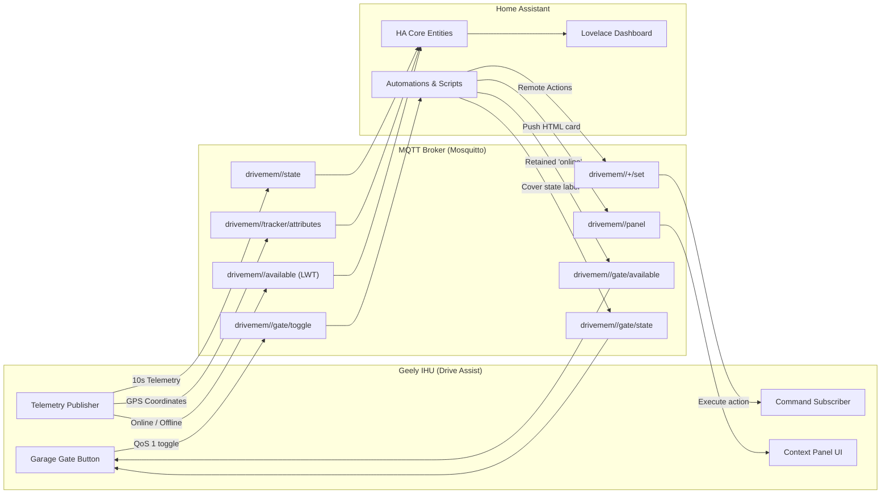

# MQTT & Home Assistant Integration Guide

> **Comprehensive setup, architecture, security, and automation reference for Drive Assist on Geely EX2 / Geometry E (IHU629G).**

Drive Assist features an integrated MQTT engine that connects your vehicle directly to **Home Assistant** (or any standard MQTT broker). It streams rich vehicle telemetry, publishes Home Assistant Auto-Discovery definitions, provides remote control commands, and allows Home Assistant to push dynamic context panels directly to the car's screen.

---

## 🏗️ Architecture & Topics Schema

### Device Naming & Topic Structure
All topics follow a predictable structure based on your vehicle's partial VIN (the last 6 characters of `sys.ecarx.vin`, e.g., `123456`):

* **Base Topic**: `drivemem/<vin>` (e.g. `drivemem/123456`)
* **Client ID**: `driveassist-<vin>` (e.g. `driveassist-123456`)
* **Device ID in Home Assistant**: `drivemem_<vin>` (e.g. `drivemem_123456`)
* **Device Name**: `Geely EX2 (<vin>)`



---

## ⚙️ Configuration in Drive Assist

Open **Settings** on the car's screen and select the **MQTT** tab.

### 1. Security & Master Toggles (Top Card)
* **Habilitar telemetria MQTT**: Master switch. When disabled, shuts down the background telemetry service, closes network sockets, and collapses the configuration UI.
* **Aceitar comandos do HA**: Security override. When disabled, incoming MQTT commands (climate steps, charging on/off, charge current limits, parking mode) are **strictly rejected**. Only telemetry upload is permitted.

### 2. Left Column: Broker Settings & Authentication
* **Endereços (Hosts)**: Enter your MQTT broker URL(s), one per line. Multiple lines provide **automatic fallback**.
  ```text
  tls://homeassistant.example.com:8883
  tcp://192.168.1.100:1883
  ```
  * `tls://` or `ssl://`: Encrypted connection (port 8883 recommended).
  * `tcp://`: Plain unencrypted connection (port 1883, only for trusted home LAN).
* **Usuário & Senha**: Broker credentials (e.g. your Home Assistant MQTT user).
* **Intervalo de Envio**: Telemetry reporting interval in seconds (default: `10` seconds; minimum: `5` seconds).
* **Salvar Configurações**: Atomically saves all fields, reconfigures the service, and reconnects in the background.

### 3. Right Column: Monitor, Actions & Live Console
* **Status Card**: Displays active broker URL, client identifier, and the timestamp of the last successful transmission.
* **[ Testar Conexão ]**: Sends an immediate on-demand telemetry sample, verifying network routing, authentication, and broker ACK.
* **[ Descoberta MQTT ]**: Re-publishes the full set of 40+ Home Assistant auto-discovery configs.
* **Console de Feedback**: Real-time monospace terminal displaying:
  * Connection handshakes and TLS cipher details
  * Topics published and PUBACK confirmations
  * Incoming command executions
  * Socket errors or connection refusal details

---

## 🔐 TLS & Mutual TLS (mTLS) Configuration

Drive Assist supports enterprise-grade **mTLS** (Mutual TLS) authentication where both the car and the broker present cryptographic certificates.

### Why use mTLS?
1. **Zero Credential Exposure**: No passwords transmitted over cellular or public Wi-Fi.
2. **Strict Identity**: Only devices possessing a valid client certificate signed by your Private CA can connect.
3. **End-to-End Encryption**: Protects vehicle GPS coordinates and status from sniffing on public networks.

### Certificates & TLS Card Options
Located inside the MQTT configuration tab:
* **Certificado Cliente (mTLS)**:
  * Requires a **PKCS#12 bundle** (`.p12` or `.pfx`) containing the client certificate, private key, and password.
  * Tap **Importar** and select the `.p12` file from storage or USB drive.
  * Enter the PKCS#12 password when prompted. Drive Assist will install it into the app's private secure keystore.
* **Certificado CA (Servidor)**:
  * For self-signed certificates or private CAs (e.g. Let's Encrypt / Step CA / OpenSSL CA).
  * Import your CA certificate (`.crt`, `.cer`, or `.pem`).
  * Tap **Restaurar** to return to standard Android system trust roots.
* **Testar Handshake TLS**:
  * Enter your TLS broker target in the field (e.g. `ssl://homeassistant.example.com:8883`).
  * Tap **Testar Handshake TLS** to perform an immediate socket handshake with full SNI validation without changing your running config.

---

## 📡 Home Assistant Auto-Discovery Entities

When connected, Drive Assist automatically creates a device named **`Geely EX2 (<vin>)`** under Settings → Devices & Services → MQTT.

### Entities Created

#### 1. Sensors (`sensor`)
| Entity ID Suffix | Name | Description | Units |
| :--- | :--- | :--- | :--- |
| `_bateria` | Bateria | High-voltage pack State of Charge (SoC) | `%` |
| `_odometro` | Odômetro | Total vehicle mileage | `km` |
| `_autonomia` | Autonomia | Estimated remaining driving range | `km` |
| `_velocidade` | Velocidade | Real-time vehicle speed | `km/h` |
| `_marcha` | Marcha | Selected transmission gear (`P`, `R`, `N`, `D`) | — |
| `_trip_total` | Trip Total | Trip odometer | `km` |
| `_corrente_de_carga` | Corrente de Carga | AC charge current reading | `A` |
| `_tensao_de_carga` | Tensão de Carga | AC/DC charging voltage | `V` |
| `_conforto` | Conforto | Thermal comfort ruler position (`C5..W5`) | — |
| `_versao_drive_assist`| Versão | Installed app build version | — |
| `_atualizacao_drive_assist`| Atualização | Available OTA update status | — |

#### 2. Binary Sensors (`binary_sensor`)
| Entity ID Suffix | Name | Description |
| :--- | :--- | :--- |
| `_ac_ligado` | AC Ligado | HVAC compressor active state |
| `_cabo_conectado` | Cabo Conectado | Physical charging cable plugged in |

#### 3. Switches (`switch`)
| Entity ID Suffix | Name | Description | Command Topic |
| :--- | :--- | :--- | :--- |
| `_carregamento` | Carregamento | Enable / disable AC charging | `.../charging/set` |
| `_modo_estacionamento` | Modo Estacionamento | Keep accessories powered while parked | `.../park/set` |
| `_adb` | ADB | Network ADB debugging on privileged Wi-Fi | `.../adb/set` |

#### 4. Numbers & Selects (`number` / `select`)
| Entity ID Suffix | Name | Description | Values |
| :--- | :--- | :--- | :--- |
| `_limite_de_corrente_de_carga` | Limite de Corrente | Max AC current | `16A`, `32A` |
| `_timer_estacionamento` | Timer Estacionamento | Parking mode duration | `15m`, `30m`, `1h`, `2h`, `infinite` |

#### 5. Buttons (`button`)
| Entity ID Suffix | Name | Description |
| :--- | :--- | :--- |
| `_mais_frio` | Mais Frio | Steps Comfort Ruler down (colder) |
| `_mais_quente` | Mais Quente | Steps Comfort Ruler up (warmer) |
| `_atualizar_drive_assist`| Atualizar | Downloads and installs latest OTA build |

#### 6. Device Tracker (`device_tracker`)
| Entity ID Suffix | Name | Attributes |
| :--- | :--- | :--- |
| `_localizacao` | Localização | `latitude`, `longitude`, `elevation`, `gps_accuracy`, `speed` |

---

## 💡 Practical Home Assistant Automations

Here are real-world automations tailored to Drive Assist:

### 1. Smart Garage Door Toggle (Comfort Screen Button)
The car's **Comfort** screen features a dynamic garage gate button. The button only displays when Home Assistant tells the car it is near home:

```yaml
- id: 'car_gate_available_when_near'
  alias: "Car — Gate available when near home"
  triggers:
    - trigger: zone.entered
      target:
        entity_id: device_tracker.geely_ex2_123456_localizacao
      zone: zone.home
    - trigger: state
      entity_id: sensor.geely_ex2_123456_marcha
  conditions:
    - condition: zone
      entity_id: device_tracker.geely_ex2_123456_localizacao
      zone: zone.home
  actions:
    - action: mqtt.publish
      data:
        topic: drivemem/123456/gate/available
        retain: true
        payload: online

- id: 'car_gate_toggle_trigger'
  alias: "Car — Open garage on car button press"
  triggers:
    - trigger: mqtt
      topic: drivemem/123456/gate/toggle
  conditions:
    - condition: zone.in_zone
      target:
        entity_id: device_tracker.geely_ex2_123456_localizacao
      zone: zone.home
  actions:
    - action: cover.open_cover
      target:
        entity_id: cover.garage_door

- id: 'car_gate_state_mirror'
  alias: "Car — Sync garage door state label"
  triggers:
    - trigger: state
      entity_id: cover.garage_door
    - trigger: mqtt
      topic: drivemem/123456/available
  actions:
    - action: mqtt.publish
      data:
        topic: drivemem/123456/gate/state
        retain: true
        payload: "{{ states('cover.garage_door') }}"

- id: 'car_gate_hide_when_leaving'
  alias: "Car — Hide gate button when away"
  triggers:
    - trigger: zone.left
      target:
        entity_id: device_tracker.geely_ex2_123456_localizacao
      zone: zone.home
  actions:
    - action: mqtt.publish
      data:
        topic: drivemem/123456/gate/available
        retain: true
        payload: offline
```

### 2. Context Panel: Pushing Dynamic HTML to the Car
Drive Assist reserves a dedicated card on the main screen subscribing to `drivemem/<vin>/panel`. Home Assistant can push live HTML, parking info, ferry lines, or alerts:

```yaml
- id: 'car_push_parking_panel'
  alias: "Car — Push parking spots on arrival"
  triggers:
    - trigger: zone.entered
      entity_id: device_tracker.geely_ex2_123456_localizacao
      zone: zone.office
  actions:
    - action: mqtt.publish
      data:
        topic: drivemem/123456/panel
        retain: true
        payload: >
          <h1>Office Parking</h1>
          <p><span class="big">{{ states('sensor.office_free_spots') }}</span> spots free</p>
          <p>EV Chargers: <strong>{{ states('sensor.office_ev_chargers_free') }}</strong> available</p>
```

---

## 🔍 Troubleshooting

| Symptom | Cause | Solution |
| :--- | :--- | :--- |
| **Status says "Desligado"** | Master toggle is off | Enable **Habilitar telemetria MQTT** at the top of the MQTT tab. |
| **"Connection refused"** | Broker port is closed or firewall blocking | Verify broker IP and port (1883 for TCP, 8883 for TLS). Confirm Mosquitto listener allows remote clients (`bind_address 0.0.0.0`). |
| **"SSLHandshakeException"** | Certificate mismatch or untrusted CA | Verify broker hostname matches the certificate Common Name / SAN. If using self-signed certs, import your CA into the **Certificados & TLS** card. |
| **Commands not responding** | Security lock active | Ensure **Aceitar comandos do HA** is turned ON at the top of the MQTT tab. |
| **Entities not showing in HA** | Auto-discovery not received | Tap **[ Descoberta MQTT ]** in the right column of the MQTT tab to re-send discovery packets. |
