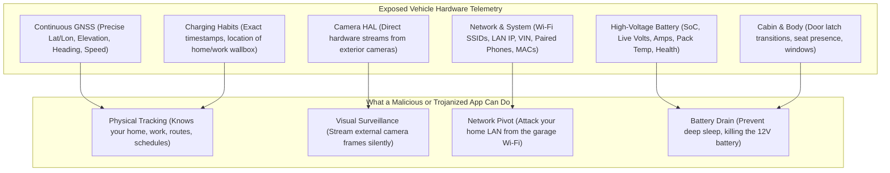
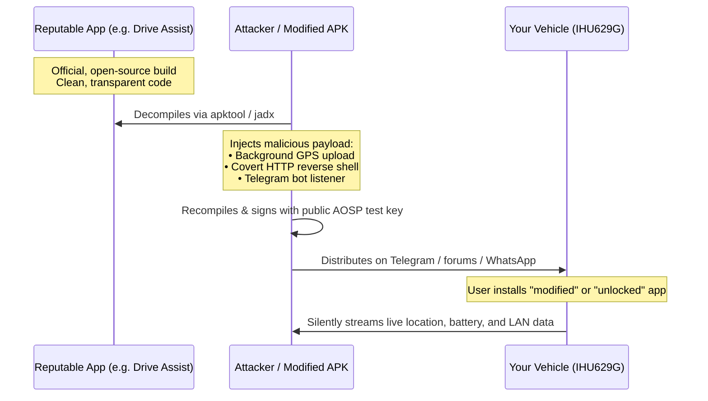

# Vehicle Software Security & Sideloading Guide

> **Understanding data exposure, platform signing keys, APK repackaging risks, and best security practices for the Geely IHU629G.**

Automotive head units running Android (like the Geely IHU629G in the Geely EX2 / Geometry E) offer unprecedented flexibility. However, running custom software inside a connected electric vehicle introduces security considerations fundamentally different from a smartphone.

This guide explains the **depth of telemetry exposed by the vehicle**, the **security architecture of this head unit**, the very real threat of **APK repackaging and trojanization**, and how to safely navigate sideloading on your car.

---

## 🚗 The Depth of Data Exposed Inside Your Car

On modern Android phones, access to location, cameras, and background activity is strictly guarded by runtime permission dialogs, background location indicators, and Play Protect.

On the IHU629G, vehicle hardware properties are exposed through the Vehicle Hardware Abstraction Layer (VHAL) and OEM adaptation services (`VehicleModules`). **Any installed app granted automotive permissions can silently access an extraordinary depth of personal and operational telemetry without prompting the driver on screen:**



### 1. Continuous Physical Location & Route Profiling
* **Precise Coordinates**: Latitude, longitude, altitude, speed, and heading are continuously refreshed by the vehicle's GNSS receiver.
* **Habit Tracking**: A malicious background service can map your home address, workplace, children's schools, grocery routines, and exact arrival/departure times.

### 2. Battery & Charging Intelligence
* **High-Voltage State**: Exact pack capacity, charging current, voltage, and internal cell temperatures.
* **Charging Infrastructure Mapping**: Reveals where you charge, how long your car stays plugged in overnight, and when you are away from home.

### 3. Camera Streams (EVS HAL)
* The vehicle's Extended View System (`android.hardware.automotive.evs@1.0`) directly streams video frames from exterior cameras.
* Because EVS operates at the automotive HAL level below standard Android camera frameworks, native clients can bind to camera feeds without triggering standard camera notification indicators.

### 4. Vehicle Network & Local Wi-Fi Environment
* When parked at home, the car joins your residential Wi-Fi network.
* An untrusted app running with root or system privileges can scan your home subnet, probe smart home devices, or open reverse tunnels into your private LAN.

---

## 🔑 The "Default Available Key" & Permission Architecture

To understand why sideloading carries high risk on this vehicle, one must understand how permissions and code signing are configured on the IHU629G.

### How Android Automotive Normally Protects Vehicle Data
In standard Android Automotive OS (AAOS), automotive permissions (such as `CAR_POWERTRAIN`, `CAR_ENERGY`, and `CAR_MILEAGE`) have a protection level of `signature|privileged`:
* **`signature`**: The app must be signed with the same cryptographic private key used to build the operating system image (the OEM's private platform key).
* **`privileged`**: The app must be pre-installed in `/system/priv-app/` and whitelisted in `/system/etc/permissions/privapp-permissions-*.xml`.

### The Reality on the Geely IHU629G
Through extensive reverse-engineering of the IHU629G platform, two major architectural findings were confirmed:

1. **The System Was Built With Public AOSP Test Keys**:
   * The platform image was compiled using the standard, publicly available Android Open Source Project test keys (`platform.pk8` / `platform.x509.pem`).
   * Anyone with access to the public AOSP git repository has the exact private key that the head unit recognizes as the platform vendor key.
   * This is why companion apps (such as `modehelper`) can declare `android.uid.system` and receive full operating system UID 1000 privileges simply by being signed with the public AOSP test key.

2. **`ro.control_privapp_permissions` Is Non-Enforcing (Empty)**:
   * On stock consumer phones, Android strictly verifies whether a sideloaded app is allowed to claim privileged permissions.
   * On this head unit, `ro.control_privapp_permissions` is unconfigured/empty.
   * **Result**: Any debug-signed APK can declare and be automatically granted `signature|privileged` automotive permissions upon installation, without requiring root.

> [!WARNING]
> **The Sideloading Reality**:
> Because the platform key is public and permission enforcement is open, **the operating system provides zero barriers against untrusted apps accessing your car's VHAL, GPS, or hardware registers.** The only line of defense is **your decision of what software to install.**

---

## 🪤 The APK Repackaging Threat (Can APKs Be Tampered With?)

### Is it possible for an APK to be repackaged?
**Yes, absolutely.** On Android, APK repackaging is a well-known, automated, and trivial process for any motivated attacker.

### How an Attacker Repackages an App


1. **Decompilation**: Using standard open-source tools (`apktool`, `jadx`), an APK can be decompiled into Smali bytecode or readable Java source within seconds.
2. **Payload Injection**: An attacker inserts a background service that:
   * Subscribes to `CarActor` or `LocationManager` to stream your live GPS location to a remote server.
   * Establishes a persistent reverse-shell allowing remote terminal commands over cellular/Wi-Fi.
   * Monitors the local Wi-Fi network when parked at home.
3. **Recompilation & Signing**: The attacker rebuilds the APK (`apktool b`) and signs it using the publicly available AOSP test key or a debug key.
4. **Distribution via Informal Channels**: The repackaged app is uploaded to car enthusiast forums, Telegram channels, or WhatsApp groups claiming to be a "new update," a "patched version with extra features," or a "special unlock."
5. **Silent Execution**: When installed in the car, the app looks, feels, and behaves 100% identically to the genuine app. The driver sees the familiar UI, while the covert payload runs silently in the background.

---

## 🛡️ Best Practices: How to Protect Your Vehicle

To enjoy the benefits of Drive Assist and custom head unit features without exposing your vehicle to malicious software, follow these essential security rules:

### 1. Always Verify the Cryptographic SHA-256 Hash
Never trust a file by its filename alone. Before installing any APK:
* Compute its SHA-256 checksum on your computer:
  ```bash
  sha256sum drive_assist.apk
  ```
* In Drive Assist, open **Settings → System**:
  The app displays the **exact SHA-256 hash of the running APK** computed directly from `/data/app/.../base.apk`.
* Compare this value against your build artifact checksum or release notes. If even a single character differs, **do not install it.**

### 2. Verify APK Signatures (`apksigner`)
Before sideloading an APK to your vehicle, inspect its signing certificate using Android SDK build-tools:
```bash
apksigner verify --verbose --print-certs drive_assist.apk
```
Confirm the certificate fingerprint matches the authorized developer build key.

### 3. Build from Source or Use Trusted Build Artifacts
* **Zero Trust for Informal Downloads**: Never install APKs sent via private messages, Telegram groups, shared Google Drives, or third-party auto forums.
* Clone the repository directly and compile it yourself with `./gradlew assembleRelease` or `./build.sh` to ensure 100% auditability.

### 4. Put Your Vehicle on an Isolated IoT / Guest Wi-Fi Network
* Configure your home Wi-Fi router to place the car on an isolated **Guest Network** or **IoT VLAN**.
* Enable client isolation so the head unit cannot scan, communicate with, or access personal computers, NAS devices, or sensitive servers on your home network.

### 5. Keep ADB Gated and Restricted
* In Drive Assist's System and MQTT settings, leave network ADB **disabled** during everyday driving.
* Drive Assist includes an **AdbGate** watchdog:
  * Network ADB can only be toggled when connected to your configured **Privileged Wi-Fi SSID**.
  * Network ADB automatically powers down after **15 minutes** of inactivity to prevent leaving a root port (`5555`) open indefinitely.

---

## 📋 Security Summary Matrix

| Threat | Vulnerability Mechanism | Impact on Vehicle | Mitigation |
| :--- | :--- | :--- | :--- |
| **Location Stalking** | Unrestricted VHAL & GNSS access | Real-time tracking of home, work, and trips | Verify APK SHA-256; inspect code |
| **APK Repackaging** | Decompilation + public AOSP test key re-signing | Hidden trojans in seemingly reputable apps | Download only from official GitHub releases |
| **Home Network Breach**| Head unit connects to home Wi-Fi | Rogue device pivot into private home LAN | Isolate car on Guest/IoT VLAN |
| **12V Battery Depletion**| Rogue service prevents deep sleep | Flat auxiliary battery; car immobilized | Inspect background wake-locks |
| **Exposed Root Shell** | Persistent ADB over port 5555 | Arbitrary root execution over vehicle network | Use Drive Assist's 15m ADB auto-timeout |
