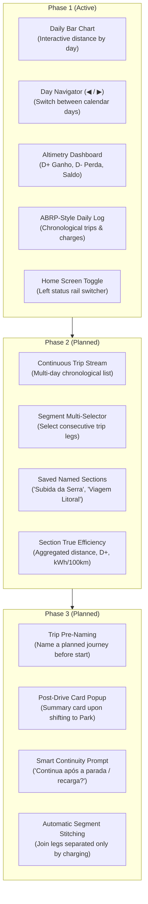

# Trip Statistics & Efficiency Telematics

Drive Assist provides comprehensive trip analysis, energy accounting, and altimetry metrics for the Geely EX2 / Geometry E (IHU629G).

---

## 🗺️ Architectural Roadmap

---

## ⚡ Phase 1: Daily Statistics & ABRP Session Log (Current)

Phase 1 provides an interactive daily overview directly on the IHU display:

*Figure 1: Drive Assist Daily Statistics View running live on the Geely EX2 IHU629G head unit (1920x1080 display). Features 14-day interactive distance bar chart (MPAndroidChart), day navigator controls (`[◀ Ontem]` and `[Amanhã ▶]`), cumulative altimetry dashboard (▲ Ganho Total D+, ▼ Perda Total D-, ↕ Saldo Líquido), battery & climate summary (59% ➔ 69% SoC, min SoC, 19.5°C), and chronological session log of drives and charging sessions.*

### 1. Interactive Daily Bar Chart & Navigation
- **Bar Chart (MPAndroidChart)**: Displays daily distance (`last_odo_km - first_odo_km`) over the past 14 days.
- **Interactive Day Selection**: Tap any column on the bar chart, or tap the **`[ ◀ Ontem ]`** and **`[ Amanhã ▶ ]`** navigation buttons to inspect that day's statistics.
- **Visual Highlighting**: The currently selected day is prominently accented while other bars remain subtle.

### 2. Cumulative Altimetry (D+ & D-)
Elevation changes heavily influence EV range. Rather than simple point-to-point elevation difference, Drive Assist tracks cumulative vertical work:
- **D+ (Ganho Positivo Acumulado)**: Sum of all climbing elevation gains throughout the day ($\sum \Delta h > 0$, noise-filtered $> 3\text{m}$).
- **D- (Perda Negativa Acumulada)**: Sum of all descending elevation losses ($\sum |\Delta h| < 0$).
- **Saldo Líquido**: $\text{D+} - \text{D-}$ (net elevation gain/loss).
- Correlating D+ with **Regeneração (kWh)** and **Eficiência (kWh/100km)** shows exactly how terrain shaped battery consumption.

### 3. ABRP-Style Chronological Session Log
Inspired by A Better Routeplanner's daily diary, the selected day's activities are displayed in an interleaved, chronological feed:
- 🚗 **Viagens (Drives)**:
  - Departure & Arrival time, duration (e.g. `08:15 – 09:30 • 1h 15m`).
  - Distance (km) and SoC change (`100% ➔ 64%`).
  - Altimetry breakdown (`▲ +680 m  ▼ -210 m`).
  - True Efficiency (`kWh/100km`) and energy regenerated (`kWh`).
- 🔌 **Recargas (Charges)**:
  - Start & completion time, duration.
  - Energy added in `+kWh`.
  - SoC change (`28% ➔ 80%`).
  - Charging speed (`kW avg`) with AC mains vs DC Fast Charge detection (`charge_v >= 250V`).

### 4. Home Screen View Switcher
- A dedicated statistics icon in the left status rail of `ComfortActivity` allows swapping the home screen between the standard comfort card grid and the new statistics screen with a single tap.

---

## 🛣️ Phase 2: Continuous Trip Segments & Named Sections (Intent)

Phase 2 will move beyond strict 24-hour calendar days to support natural multi-leg journeys:

1. **Continuous Trip Feed**:
   - A scrolling timeline of discrete driving trips (`trip` table), crossing midnight boundaries seamlessly.
2. **Multi-Leg Selection**:
   - Checkboxes or gesture selection to pick multiple sequential trips (e.g., Trip #42, Trip #43, and Trip #44).
3. **Saved Named Sections**:
   - Name and persist custom sections (e.g., *"Viagem a Curitiba"*, *"Subida da Serra"*, or *"Corrida de Aplicativo - Sexta"*).
4. **The True Trip Efficiency Aggregate**:
   - Calculates combined metrics across all selected legs:
     - Distance $= \text{Odo}_{\text{end}} - \text{Odo}_{\text{start}}$.
     - Cumulative D+ and D-.
     - Total Regen captured (kWh).
     - Time-weighted HVAC active percentage.
     - True integrated efficiency (kWh/100km).

---

## 🤖 Phase 3: Interactive Trip Assistant (Intent)

Phase 3 will introduce smart trip lifecycle management:

1. **Trip Pre-Naming & Departure Intent**:
   - Driver can name an upcoming trip before departure (or via Home Assistant MQTT command).
2. **Post-Drive Arrival Card**:
   - When shifting to Park (`gear = 4`), a summary card automatically displays key stats for that specific leg.
3. **Smart Continuity Prompt**:
   - The card will prompt: *"Deseja continuar esta viagem após a parada ou recarga?"*
   - If confirmed, subsequent driving legs and charging stops remain stitched into the same active session until the driver marks it finished.
