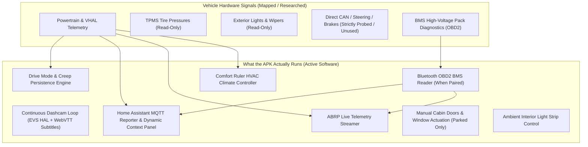

# Welcome to Drive Assist (DriveMem)

> **Transparency, Control, and Safety for the Geely EX2 / Geometry E (IHU629G)**

Welcome to **Drive Assist**! This guide provides complete and transparent disclosure of what this application does, what vehicle data it accesses, what actuators it can control, the exact boundary between mapped hardware signals and running software, and the safety measures designed to protect you, your vehicle, and your privacy.

---

## 🧭 Philosophy & Purpose

Factory electric vehicle infotainment units often isolate data and forget driver preferences every time the car turns off. Drive Assist runs natively on the Android head unit (IHU629G) to:
1. **Preserve Driver Comfort & Preferences**: Automatically restore your chosen driving dynamics (Eco/Comfort/Sport and Creep Mode) upon startup.
2. **Provide Local-First Telemetry**: Send vehicle diagnostics directly to your personal **Home Assistant** server without proprietary subscription clouds.
3. **Enhance Road Trips**: Stream live battery consumption and state of charge directly to **A Better Routeplanner (ABRP)** for precise route and charging predictions.
4. **Offer Smart Dashcam Recording**: Record camera feeds with live telemetry overlays and easy USB export.

---

## 🚗 Live Vehicle Interface: Comfort View

The primary driver interface is designed specifically for the Geely EX2 (IHU629G) landscape screen (1920x1080 @ 160 dpi / 1.0 density factor), providing instant at-a-glance status and tactile climate controls:


*Figure 1: Drive Assist Comfort View running live on the Geely EX2 / Geometry E IHU629G head unit. Showcases outdoor ambient temperature (20°C), the 11-column Comfort Ruler HVAC scale (`C5..0..W5`), real-time high-voltage charging card (69% SoC, 16 min elapsed, ~175 min remaining to 100%), window purge and recirculation quick-toggles, and the left-rail navigation dock.*

---

## ⚖️ Mapped Capabilities vs. What the APK Actually Does

During the reverse-engineering of the IHU629G platform, over a hundred hardware signals and function IDs were identified and documented in our [DATA-CATALOG.md](DATA-CATALOG.md) and [field-catalog.md](field-catalog.md). However, **there is a strict difference between what the vehicle hardware exposes and what Drive Assist actually executes.**



### 1. What the APK ACTUALLY Implements
* **Drive Mode & Creep Memory**: Automatically applies your saved drive profile (`ECO`, `COMFORT`, `SPORT`) and creep toggle on ignition via the privileged companion app [`modehelper`](../modehelper/README.md).
* **Comfort Ruler (HVAC)**: Calibrated single-slider thermal control (`C5..0..W5`) translating desired cabin comfort into fan, temperature, and AC compressor commands without reversing the factory state machine (illustrated in Figure 1 above and documented in [HVAC Effort Table Architecture](COMFORT-TABLE.md)).
* **Continuous Hardware Dashcam**: Directly attaches to the native automotive video stream (`android.hardware.automotive.evs@1.0`), hardware-encodes video (`MediaCodec`), burns in synchronized WebVTT telemetry subtitles (speed, gear, coordinates), and supports one-tap USB clip export.
* **Home Assistant MQTT Telemetry & Controls**: Publishes 40+ vehicle sensors every 10–15 seconds with Home Assistant Auto-Discovery, displays live custom HTML from HA on the center console (`/panel`), and executes remote commands (climate steps, charging on/off, charge current limits, parking mode, OTA updates) only when explicitly unlocked by the driver.
* **ABRP Live Telemetry**: Streams real-time SoC, consumption, speed, GPS, and elevation every 6 seconds to `api.iternio.com`, with an offline in-memory queue for tunnels and dead zones.
* **Bluetooth OBD2 BMS Reader**: Interfaces with a paired OBD2 adapter to poll the Battery Management System (ECU `0x7E2`) for 0.1% fine SoC, battery voltage, current, and pack temperature.
* **Window Pressure Relief & Purge**: Implements **DoorWindow** (cracks windows by 10% when a door opens to eliminate cabin pressure slam, then closes on door latch) and **Purge** (lowers windows halfway on manual button press to purge hot air).
* **Safety & Access Guard**: Enforces touch cooldowns to prevent accidental double-taps, restricts network ADB to a privileged Wi-Fi SSID, and enforces an automatic 15-minute ADB timeout.

### 2. What is Mapped as Read-Only (Never Actuated by the APK)
* **Doors & Latches**: Door latch positions (`car.door_pos`) and lock statuses (`0x264020AA`) are monitored as read-only telemetry. **The APK contains NO code to lock or unlock doors, and NO code to release the trunk latch.**
* **TPMS Tire Pressures**: The app reads tire pressures and temperatures for telemetry and display, but does not interact with the TPMS ECU.
* **Exterior Lights**: Headlights, high beams, position lights, and turn signals are read-only telemetry states. The app **never** actuates exterior driving lights. (Only interior cabin ambient LED strip color/brightness can be adjusted).
* **Wipers, Horn & Alarms**: Mapped in the hardware catalog, but the APK contains zero actuation code for them.

---

## 🔌 The OBD2 Connection Reality & Pairing Requirement

One of the most important hardware enhancements in Drive Assist is connecting to a Bluetooth OBD2 dongle to read true battery pack voltage, current, and cell temperature directly from the Battery Management System (BMS ECU `0x7E2`).

> [!IMPORTANT]
> **IHU629G Bluetooth Pairing Architecture**:
> On the Geely IHU629G, pairing an OBD2 dongle from the car's standard Bluetooth settings screen **will fail 100% of the time** out of the box. 

### Why Standard Pairing Fails
1. The head unit's factory Android 9 Bluetooth stack has an internal auto-pairing PIN hardcoded in `/system/etc/bluetooth/btDefSetting.json` set to `"pairingCode": "0000"`.
2. Standard OBD2 / ELM327 adapters (such as vLinker MC+, OBDLink, or Veepeak) expect PIN `"1234"` by default.
3. When pairing is initiated, the head unit silently sends `"0000"` to the dongle **without ever displaying a PIN entry prompt on the screen** and without broadcasting `ACTION_PAIRING_REQUEST`.
4. The dongle immediately rejects `"0000"` with `AUTHENTICATION_FAILURE` (`UNBOND_REASON_AUTH_FAILED`).

### Resolution Architecture (ADB Override)
To pair an OBD2 dongle, root ADB access is required to override the default system PIN:
1. **Method A — Modifying `btDefSetting.json`**:
   Using the script in `bt-pin-fix/apply-pin-1234.sh`:
   ```bash
   adb root
   adb remount
   # Changes "pairingCode": "0000" -> "1234" in /system/etc/bluetooth/btDefSetting.json
   adb shell svc bluetooth disable
   adb shell svc bluetooth enable
   ```
   Once updated, pairing from the car's screen or companion app succeeds immediately with PIN `1234`.
2. **Method B — Headless Pairing via `modehelper`**:
   The companion app [`modehelper`](../modehelper/README.md) has system-level `BLUETOOTH_PRIVILEGED` rights and provides command-line pairing via broadcast:
   ```bash
   adb shell am broadcast -a com.geely.modehelper.BT_PAIR --es addr <DONGLE_MAC> --es pin 1234 -n com.geely.modehelper/.BtPairReceiver
   ```

> [!TIP]
> **OBD2 is Completely Optional**:
> If you do not have an OBD2 dongle or have not performed the ADB pairing setup, **Drive Assist operates seamlessly using the car's built-in VHAL**. Battery SoC (whole-percent) and charging telemetry continue to report normally to Home Assistant and ABRP.

---

## 👁️ What the App Sees (Data Read)

Drive Assist reads data from the vehicle's internal Vehicle Hardware Abstraction Layer (VHAL), OEM adaptation layers (`VehicleModules`), onboard GNSS (GPS), and optional Bluetooth OBD2 dongles.

### 1. High-Voltage Battery & Charging
| Data Field | Source | Description | Precision |
| :--- | :--- | :--- | :--- |
| **State of Charge (SoC)** | VHAL / OBD2 | Battery percentage | Integer % (VHAL) or 0.1% (OBD2) |
| **Pack Voltage & Current** | OBD2 / BMS | High-voltage pack electrical measurements | Real-time Volts (V) and Amperes (A) |
| **Instant Power** | OBD2 / VHAL | Energy flow into or out of the pack | Kilowatts (kW), +/- for regen/discharge |
| **Battery Temperature** | OBD2 / BMS | High-voltage pack core temperature | Degrees Celsius (°C) |
| **Charging Cable Status** | VHAL | Physical plug insertion detection | Plugged in / Disconnected |
| **Charging State & Limits** | VHAL | AC charging active/idle, 16A vs 32A limit | Current limit setting, charging status |

### 2. Dynamics & Powertrain
| Data Field | Source | Description |
| :--- | :--- | :--- |
| **Vehicle Speed** | Cluster / VHAL | Wheel speed sensors in km/h |
| **Selected Gear** | Transmission ECU | Active gear position (`P`, `R`, `N`, `D`) |
| **Odometer** | Instrument Cluster | Total accumulated mileage in kilometers |
| **Estimated Range** | Cluster ECU | Remaining driving range estimated by car |
| **Drive Mode** | VHAL | Active drive profile (`ECO`, `COMFORT`, `SPORT`) |
| **Creep Mode** | VHAL | Low-speed accelerator release crawl setting |

### 3. Environment & Location
| Data Field | Source | Description |
| :--- | :--- | :--- |
| **GPS Position** | IHU GNSS | Latitude, longitude, altitude, heading, accuracy |
| **Outside Temperature** | HVAC ECU | Ambient air sensor behind front bumper (°C) |

### 4. Body, Cabin & Peripherals
| Data Field | Source | Description |
| :--- | :--- | :--- |
| **Doors & Latches** | Body Controller | Open/closed status of doors, trunk, and hood |
| **Windows** | Window Modules | Window height / cracked ventilation status |
| **HVAC & Climate** | HVAC Controller | Fan speed, target temp, compressor status, recirculation |
| **Tire Pressures & Temps** | TPMS | Direct pressure (bar/psi) and temperature per tire (Read-only) |
| **External Lighting** | Lighting Module | Position lights, low beams, high beams (Read-only) |
| **Cameras** | EVS HAL | Front and rear cameras via native video stream |
| **Media Playback** | Android Media | Active song, artist, album art, playback state |

---

## 🛡️ Safety Boundaries & Actuator Limitations

> [!CAUTION]
> **Non-Negotiable Safety Boundaries**:
> Drive Assist is engineered with absolute physical and software firewalls. It interacts exclusively with comfort, body, and infotainment controllers.

### What the App CAN Control
* HVAC target temperature, fan speed, and AC compressor toggle via the Comfort Ruler
* Drive mode selection (`ECO`, `COMFORT`, `SPORT`) and creep mode
* Interior cabin ambient LED color and brightness
* Window crack on door open (`DoorWindow`) and manual hot-air purge (`Purge`, parked only)
* AC charging toggle and AC charging current limit (16A / 32A)
* Parking mode accessory power keep-alive and timer

### What the App CANNOT Touch
* ❌ **No Door Locking / Unlocking**: The app has no lock/unlock actuators or commands. Door latches are read-only sensors.
* ❌ **No Trunk Release**: The trunk latch cannot be opened or released by the app.
* ❌ **No Steering Intervention**: The app cannot turn the steering wheel or influence lane assist.
* ❌ **No Braking Control**: The app has zero interface to the friction braking or ABS system.
* ❌ **No Acceleration / Throttle**: The app cannot command motor torque or accelerate the vehicle.
* ❌ **No High-Voltage Contactors**: The app cannot force high-voltage battery contactors open or closed during driving.
* ❌ **No Airbag / Safety Systems**: The SRS and restraint systems are completely isolated and inaccessible.

---

## 🔒 Security & Privacy Safeguards

### 1. Remote Commands Lock ("Aceitar Comandos do HA")
In the MQTT settings, the **Accept Commands from HA** switch is a master safety override:
- When **Disabled**: The MQTT client strictly drops all incoming command topics (`/set`, `/toggle`). The car only *publishes* telemetry and accepts zero incoming commands.
- When **Enabled**: Remote commands from your private Home Assistant instance are processed.

### 2. Touch Cooldown Prevention
To prevent accidental repeated clicks on the vehicle touchscreen while driving or parking:
- All sensitive action buttons enforce a software **cooldown timer** (default: 3 seconds).
- Repeated taps during the cooldown window are ignored and accompanied by visual feedback.

### 3. Moving Vehicle Safeguards
- Actuator actions that pose safety hazards (such as window roll-down via Purge) verify vehicle speed and transmission state.
- Actions are automatically blocked if the car is moving in gear (`D` or `R`).

### 4. ADB Security Gate (Maintenance Access)
Android Debug Bridge (ADB) allows low-level terminal debugging:
- **Default Closed**: Network ADB is permanently off unless explicitly triggered.
- **Wi-Fi Whitelist**: Can only be enabled when connected to your configured **Privileged Wi-Fi SSID**.
- **Auto-Shutoff Timer**: ADB automatically terminates after 15 minutes of inactivity.

### 5. Data Privacy & Local-First Architecture
* **Zero Telemetry to Third-Party Clouds**: Drive Assist does not report vehicle usage, GPS logs, or driving habits to Geely, Google, or any analytics provider.
* **Direct Encryption**: Communication to your Home Assistant server supports **Mutual TLS (mTLS)** with client certificates, ensuring no open or plaintext traffic over the internet or public Wi-Fi hotspots.
* **Optional Location Sharing**: GPS streaming to ABRP can be toggled off at any time via the `abrp_send_location` switch.

---

## ⚠️ Risks & Considerations

| Consideration | Details | Best Practice |
| :--- | :--- | :--- |
| **12V Auxiliary Battery** | Frequent background polling or prolonged parked Wi-Fi connection could theoretically deplete the 12V battery. | Drive Assist halts background polling when the car is parked and off. The IHU automatically enters deep standby when the car is locked. |
| **Bluetooth PIN Override** | Overriding `/system/etc/bluetooth/btDefSetting.json` to `"1234"` is a global change affecting future phone pairing requests. | If pairing a new phone that expects `"0000"`, enter `"1234"` on the phone, or run `bt-pin-fix/revert-pin-0000.sh` before dealer visits. |
| **Network Tethering** | Streaming high-frequency telemetry (MQTT/ABRP) consumes mobile data if tethered via personal hotspot. | At 10s intervals, telemetry consumes approximately 2–5 MB per driving hour. |
| **Firmware Updates** | Official dealership firmware updates to the IHU may overwrite root access or system modifications. | Always back up configuration files and follow the update guide in [docs/GUIA-ADB-IHU629G.md](GUIA-ADB-IHU629G.md). |

---

## 📚 User Documentation Guides

Detailed step-by-step guides for configuring each integration:

- 🏠 **[MQTT & Home Assistant Guide](MQTT-GUIDE.md)**: Full setup for Home Assistant auto-discovery, broker configuration, mTLS certificates, topic schemas, and garage door automations.
- ⚡ **[ABRP Telemetry Guide](ABRP-GUIDE.md)**: How to link your vehicle to A Better Routeplanner, configure generic tokens, and pair a Bluetooth OBD2 dongle with the ADB pairing override.
- 🔧 **[ADB Setup & Troubleshooting](GUIA-ADB-IHU629G.md)**: How to manage the Android environment, install updates, and inspect system logs.
